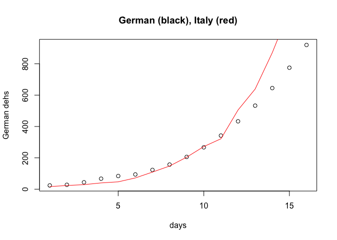
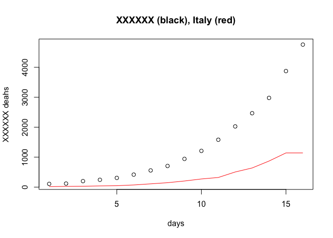
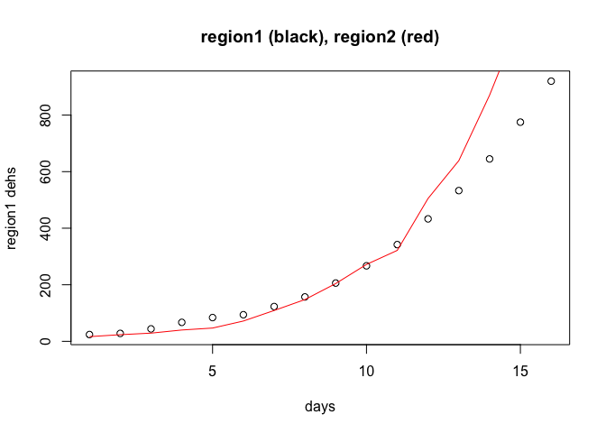
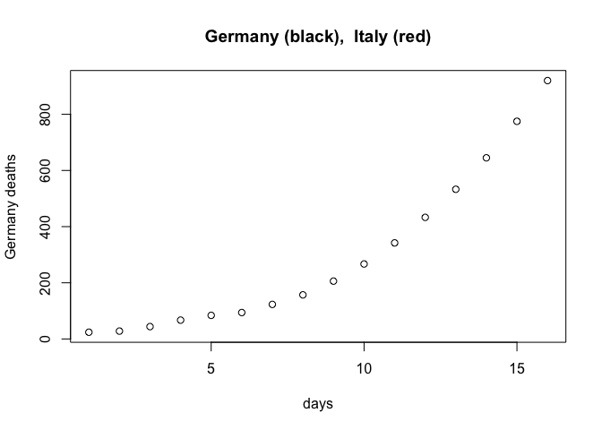

# Comparing any two countries

(… draft … under construction …)

**Lesson 3:**

[lesson-03.Rmd](lesson-03.Rmd)  
[lesson-03.md](lesson-03.md)

## Recap from Lesson 2

``` r
mydata = read.csv(url("https://raw.githubusercontent.com/CSSEGISandData/COVID-19/master/csse_covid_19_data/csse_covid_19_time_series/time_series_covid19_deaths_global.csv"))
View(mydata)
```

Show the last date for which there is data

``` r
View(colnames(mydata)[ncol(mydata)]) 
```

Get some indices of rows of some countries

``` r
germany <- 121       
usa <- 226       
italy <- 138
```

In the exercises of Lesson 2 we took the code for plotting Germany vs
Italy

``` r
range <- 15           
germany_first <- 15   
italy_first <- 35     
population_ratio_germany_italy <- 1.38

german_deaths <- mydata[germany,(ncol(mydata)-germany_first):(ncol(mydata)-germany_first+range)]
german_deaths <- gsub(",", "", german_deaths)                     
german_deaths <- as.numeric(german_deaths)                      
plot(german_deaths, col="black", main="German (black), Italy (red)",xlab="days", ylab="German dehs")   

italian_deaths <- mydata[italy,(ncol(mydata)-italy_first):(ncol(mydata)-italy_first+range)]
#View(mydata[italy,1:2])       
italian_deaths <- gsub(",", "", italian_deaths)                   
italian_deaths <- as.numeric(italian_deaths)                      
lines(population_ratio_germany_italy*italian_deaths, col="red")   
```

<!-- -->

and adapted it to compare another country with Italy, say, XXXXXX:

``` r
XXXXXX <- usa
range <- 15           
XXXXXX_first <- 15   
italy_first <- 35     
population_ratio_XXXXXX_italy <- 1.38

XXXXXX_deaths <- mydata[XXXXXX,(ncol(mydata)-XXXXXX_first):(ncol(mydata)-XXXXXX_first+range)]
XXXXXX_deaths <- gsub(",", "", XXXXXX_deaths)                     
XXXXXX_deaths <- as.numeric(XXXXXX_deaths)                      
plot(XXXXXX_deaths, col="black", main="XXXXXX (black), Italy (red)",xlab="days", ylab="XXXXXX deahs") 

italian_deaths <- mydata[italy,(ncol(mydata)-italy_first):(ncol(mydata)-italy_first+range)]
#View(mydata[italy,1:2])       
italian_deaths <- gsub(",", "", italian_deaths)                   
italian_deaths <- as.numeric(italian_deaths)                      
lines(population_ratio_XXXXXX_italy*italian_deaths, col="red")   
```

<!-- -->

Changing code by hand in many places for each new country is not only
painful, but also bad software engineering. Why?

  - It is boring and repetitive.
  - It is error prone.

**Rule of Good Practice**: Never copy and paste a piece of code more
than once. Rather refactor your software.

How can we write code that can easily be adapted to any two countries?

Ideally, **we only want to change the name of each country once.**

How can we do this?

### Step 1: Introduce generic variabales

Here is the idea. First run the code below

``` r
XXXXXX <- usa
```

and then the code above about comparing XXXXXX vs Italy. But before
doing this, answer for yourself: Do you expect this to work or not?

**Rule of Good Practice:** Never run code before telling yourself what
result you expect. If the actual result is not the expected one, update
your mental model of the code (or the machine running the code).

**Exercise:** In this particular case, how do you update your mental
model of the code, or even the code itself?

#### Step 1: Introduce generic variabales

Idea: Rewrite the code above with variable names that are not specific
to Italy and to XXXXXX.

**Rule of Good Practice:** Think carefully about variable names. This
will help with readability and maintenance.

In our case, while the first idea was to have variables `country1` and
`country2`, we may want to use the code for regions that are not
countries such as California or New York. So we decided on to start with

``` r
region1 <- 121 # fill in the row of region 1
region2 <- 138 # fill in the row of region 2
```

The comments are marking the two places where variables will be changed
to refer to the particular countries/regions in question.

``` r
range <- 15           
region1_first <- 15   
region2_first <- 35     
population_ratio_region1_region2 <- 1.38
```

These four variables above also depend on the particular regions in
question and currently need to be modified by hand. We can think later
whether this data can be computed from `region1` and `region2` instead.

``` r
region1_deaths <- mydata[region1,(ncol(mydata)-region1_first):(ncol(mydata)-region1_first+range)]
region1_deaths <- gsub(",", "", region1_deaths)                     
region1_deaths <- as.numeric(region1_deaths)                      
plot(region1_deaths, col="black", main="region1 (black), region2 (red)",xlab="days", ylab="region1 dehs")   

region2_deaths <- mydata[region2,(ncol(mydata)-region2_first):(ncol(mydata)-region2_first+range)]
#View(mydata[region2,1:2])       
region2_deaths <- gsub(",", "", region2_deaths)                   
region2_deaths <- as.numeric(region2_deaths)                      
lines(population_ratio_region1_region2*region2_deaths, col="red")   
```

<!-- -->

Does it run? If not debug it.

Now it is running, what next? How can we improve the program?

**Rule of Good Practice:** Solving a problem and implementing the
solution takes much less work than embedding the solution in a nice
software package that is easy to use.

In our case, comparing Germany vs Italy in a particular time interval is
much faster to implement then to develop a flexible tool that allows us
to compare any countries over any time intervals and then to visualise
the results in interesting ways.

One thing we want to improve on is the labelling of the graph.

``` r
plot(region1_deaths, col="black", main="region1 (black), region2 (red)",xlab="days", ylab="region1 deaths")   
```

<!-- -->

We want the labelling to be parametric, that is, whatever values we
choose for `region1` and `region2`, the graph should be labelled with
the names of the respective regions

``` r
plot(region1_deaths, col="black", main=paste(mydata[region1,2], "(black), ", mydata[region2,2],  "(red)"), xlab="days", ylab=paste(mydata[region1,2], "deaths"))   
```

<!-- -->

Note how the code replaces \`“Region 1” by “Germany” and “Region 2” by
“Italy”.

**Exercise:** Change the values of the variables `region1` and `region2`
to obtain plots for different countries.
