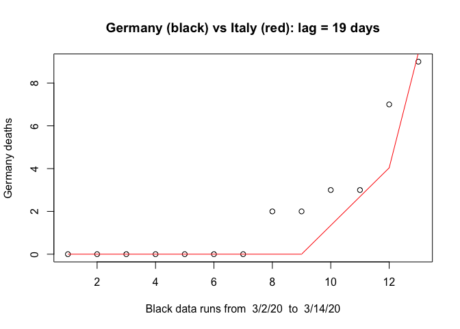
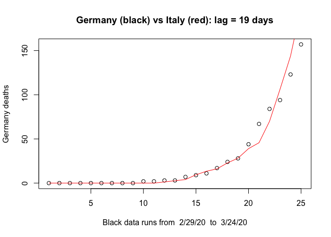
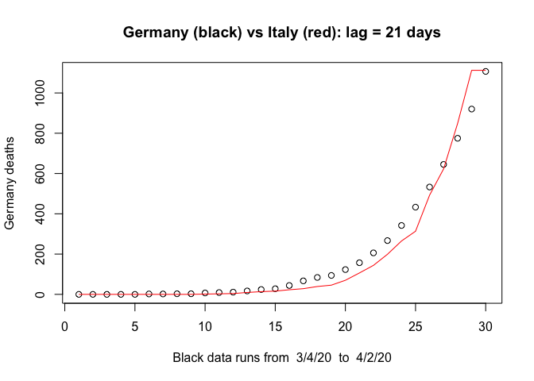

``` r
source("../src/library.R")
```

# Report Germany vs Italy

On
[March 13](https://en.wikipedia.org/wiki/2020_coronavirus_pandemic_in_Germany),
most federal German states closed there schools. At the time the
comparison of deaths in Germany and Italy looked like this:

``` r
deaths_2_countries(region1="Germany",region2="Italy",region1_first=31,region2_first=50,range=12)
```

<!-- -->

How was the situation 19 days earlier in Italy? On 23 February 2020,
Austria [suspended all trains to and from
Italy](https://en.wikipedia.org/wiki/2020_coronavirus_pandemic_in_Italy#Travel_restrictions)
for a few hours because of suspected cases. But how was the mood in
Italy at the time? Did Italy suspect what was lying ahead?

On 20 March, Bavaria was the first state to declare a curfew, inspired
by an identical one in Austria implemented four days before. At the time
the deaths had developed as follows:

``` r
deaths_2_countries(region1="Germany",region2="Italy",region1_first=33,region2_first=52,range=24) 
```

<!-- -->

And here is the situation from end of March

``` r
deaths_2_countries(region1="Germany",region2="Italy",region1_first=29,region2_first=50)
```

<!-- -->
